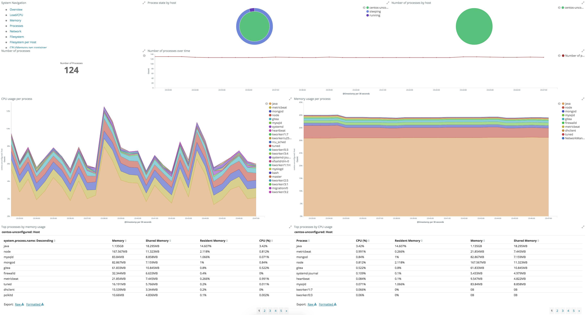
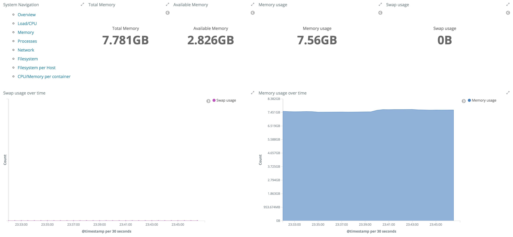

# Elastic's Kibana Build, Operate, Maintain
This project is created and maintained by the Elastic Beats team. All credit for the service goes to their talented team.

_Beats is the platform for single-purpose data shippers. They install as lightweight agents and send data from hundreds or thousands of machines to Logstash or Elasticsearch._

## Beats
Included with CAPES is Heartbeat, Filebeat, and Metricbeat. While these two are very different, the BOM documentation is combined for simplicity.

For a description of Heartbeat, Filebeat, and Metricbeat, please see the [README](README.md) at the root of this directory.

Additionally, the great team over at Elastic created some default visualizations and dashboards for Metricbeats and Heartbeats that are built into CAPES. They aren't needed to see the data, but...you know...charts and stuff.

## Build
**It should be noted, this build is using Heartbeat and Metricbeat 5.6 to align with the installation of Elasticsearch and Kibana 5.6. When TheHive is updated to Elasticsearch 6.0, Kibana and Beats will be close behind.**

### Dependencies
There are no dependencies. Beats (Heartbeat and Metricbeat) are installed using `deploy_capes.sh` script in the root of this repository.

### Server Build
Please see the [server build instructions](../docs/README.md#build-your-os).

### Installation
Run the [CAPES deployment script](../deploy_capes.sh) or deploy manually:

Deploying with CAPES (recommended):
```
sudo yum install -y git
git clone https://github.com/capesstack/capes.git
cd capes
sudo sh deploy_capes.sh
```
Deploying manually:
```
sudo yum install -y https://artifacts.elastic.co/downloads/beats/heartbeat/heartbeat-5.6.5-x86_64.rpm https://artifacts.elastic.co/downloads/kibana/kibana-5.6.5-x86_64.rpm https://artifacts.elastic.co/downloads/beats/filebeat/filebeat-5.6.5-x86_64.rpm
sudo /usr/share/elasticsearch/bin/elasticsearch-plugin install ingest-user-agent
sudo /usr/share/elasticsearch/bin/elasticsearch-plugin install ingest-geoip
sudo systemctl enable heartbeat.service
sudo systemctl enable metricbeat.service
sudo systemctl enable filebeat.service
sudo systemctl start filebeat.service
sudo systemctl start heartbeat.service
sudo systemctl start metricbeat.service
```
**Note, version 6.0 changes the service name to `heartbeat-elastic.service` and `metricbeat-elastic.service`, so don't get twisted on which version you're working with when reading Elastic's documentation**

## Operate
Immediately following installation of CAPES (or Metricbeats individually), you need to go to update your MariaDB root passphrase in the Metricbeat configuration file. If you don't do this, the MySQL visualizations and dashboards won't be populated.  
1. `sudo vi /etc/metricbeat/metricbeat.yml`
1. change "passphrase_to_be_set_post_install" to your root passphrase you set during the MySQL securing process
1. `sudo systemctl restart metricbeat.service`

One you have installed Beats, you need to go into Kibana and create the Heartbeat, Filebeat, and Metricbeat Index Patterns.

Browse to http://<capes_ip> and select "Kibana" from the landing page. You will be directed to the Index setup page.

The Heartbeat and Metricbeat Index Patterns _should_ have been added, but you'll need to define a Default Index Pattern. `heartbeat-*` or `metricbeat-*`, the choice is yours which your default is. You do this by selecting either one of them and then clicking the "Star" in the upper right of the Kibana screen. You can swap between indicies at will, but you need to set a default.

If Metricbeat or Heartbeat aren't there, this isn't a problem, see Troubleshooting to fix the issue.
  

The Filebeat Index Pattern will need to be manually added by clicking on `Create Index Pattern` and typing `filebeat-*` and clicking `Create`.

Once you have completed the Index Pattern setup, click on the "Discover Tab" on the top left of your screen to start exploring data. You can flip between indicies right above the `Selected Fields` section.
~[switch_index](img/index_switch.png)

### Dashboards
This is really neat, but feel free to explore on your own. There should be some default dashboards for Metricbeat and Heartbeat loaded. If not, see the Troubleshooting section.







### Deleting Data
In the event you want to delete some Beat data, use this
```
curl -XDELETE 'http://localhost:9200/heartbeat-*' #Heartbeat data
curl -XDELETE 'http://localhost:9200/metricbeat-*' #Metricbeat data
curl -XDELETE 'http://localhost:9200/filebeat-*' #Filebeat data
```

## Maintain

### Package Locations
Heartbeat configuration file - `/etc/heartbeat/heartbeat.yml`  
Heartbeat directory - `/usr/share/heartbeat/`  
Metricbeat configuration file - `/etc/metricbeat/metricbeat.yml`  
Metricbeat directory - `/usr/share/metricbeat/`  
Filebeat configureation file - `/etc/filebeat/filebeat.yml`  
Filebeat directory - `/usr/share/filebeat/`  

### Update Configurations
All Yaml files are available to update and are fairly straight forward to tweak and adjust; however, if you are looking to do something a bit more advanced, I recommend you check out the Elastic configuration guide for [Heartbeat](https://www.elastic.co/guide/en/beats/heartbeat/5.6/heartbeat-getting-started.html), [Metricbeat](https://www.elastic.co/guide/en/beats/metricbeat/5.6/metricbeat-getting-started.html), and [Filebeat](https://www.elastic.co/guide/en/beats/filebeat/5.6/filebeat-getting-started.html).

## Troubleshooting
In the event that your Index Patterns have not been automatically added for Metricbeat and Heartbeat, you can manually add them by creating a new Index Pattern and typing `heartbeat-*` and/or `metricbeat-*` in the Management > Index Patterns section
    

...or, easier, you can just run `/usr/share/metricbeat/scripts/./import_dashboards` and `/usr/share/heartbeat/scripts/./import_dashboards` which loads the Index Patterns **and** a litany of visualizations and dashboards.

Truth be told, this should be done during installation; but it seems to be hit & miss...something with the order that Elasticsearch starts(?). In either case, there ya go.
